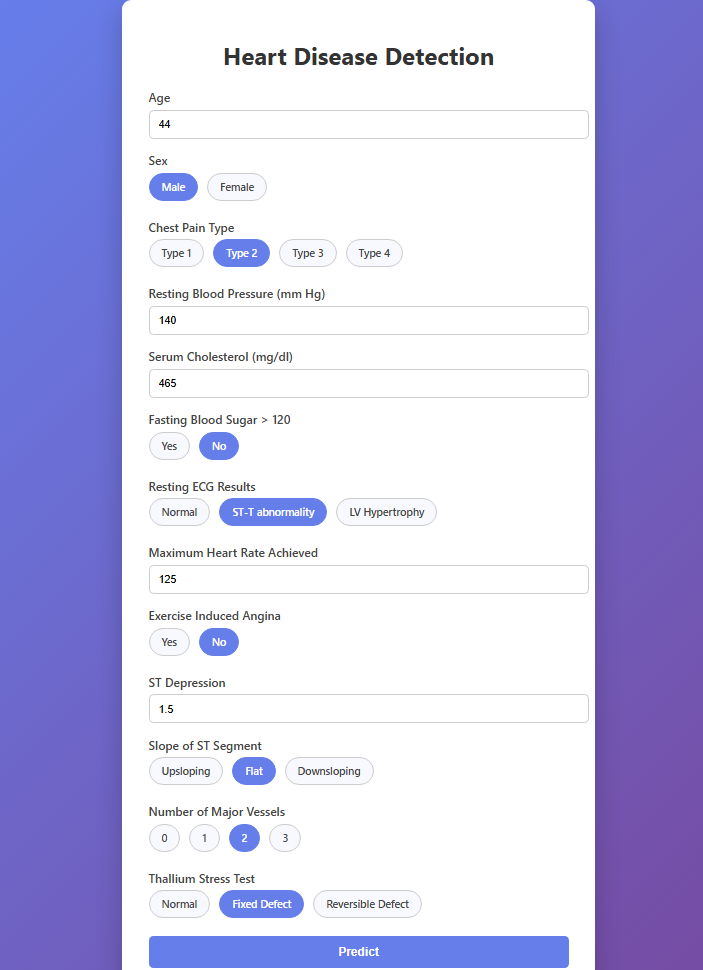

# ❤️ Heart Disease Detection System

## Overview

A full-stack Machine Learning web application that predicts the
likelihood of heart disease based on patient clinical data. The project
combines data processing, model training, and a FastAPI-based web
interface, and is designed to be production-ready.

------------------------------------------------------------------------

## 🎯 Project Objectives

-   Build a machine learning model to predict heart disease
-   Validate user inputs using Pydantic
-   Serve predictions through a FastAPI backend
-   Provide a clean HTML-based frontend
-   Prepare the project for Dockerization and AWS deployment

------------------------------------------------------------------------

## 🧠 What Was Done

### Data Pipeline

-   Raw data ingestion and schema validation
-   Data preprocessing including scaling and label encoding

### Model Training

-   Logistic Regression model trained on processed data
-   Model evaluation performed before saving artifacts

### Backend

-   FastAPI application to serve predictions
-   Pydantic models for strict input validation
-   Jinja2 templates for rendering HTML pages

### Frontend

-   Clean and modern HTML/CSS UI
-   Radio buttons and numeric inputs for better UX
-   Prediction results rendered dynamically

------------------------------------------------------------------------

## 🗂 Project Structure

-   artifacts/ → Trained model, scaler, encoders
-   data/ → Raw and processed datasets
-   src/heart_disease → Application source code
-   templates/ → HTML templates
-   logs/ → Application logs

------------------------------------------------------------------------

## 🚀 Deployment

-   Docker-ready project structure
-   Intended deployment on AWS using Docker containers

------------------------------------------------------------------------

## 🛠 Tech Stack

-   Python
-   FastAPI
-   Pydantic
-   Scikit-learn
-   HTML / CSS
-   Docker
-   AWS

------------------------------------------------------------------------

## 🐳 Dockerization

The complete Heart Disease Detection application has been **Dockerized** to ensure consistent execution across environments and simplify deployment.

### 📦 Docker Image Build
The Docker image was built from the project root directory using:

```bash
docker build -t titanexasaur/heart .
```

### ▶️ Running the Docker Container
The container is run by mapping the internal application port to the host machine:

```bash
docker run -p 8888:8888 titanexasaur/heart
```

Once the container is running, the application can be accessed at:

```
http://localhost:8888
```

### 🚀 Benefits of Dockerization
- Environment consistency  
- Easy deployment to AWS or any cloud platform  
- No dependency conflicts  
- Simplified setup and scaling  

## Preview of Application



available to use [here](http://51.20.7.103:8888/)